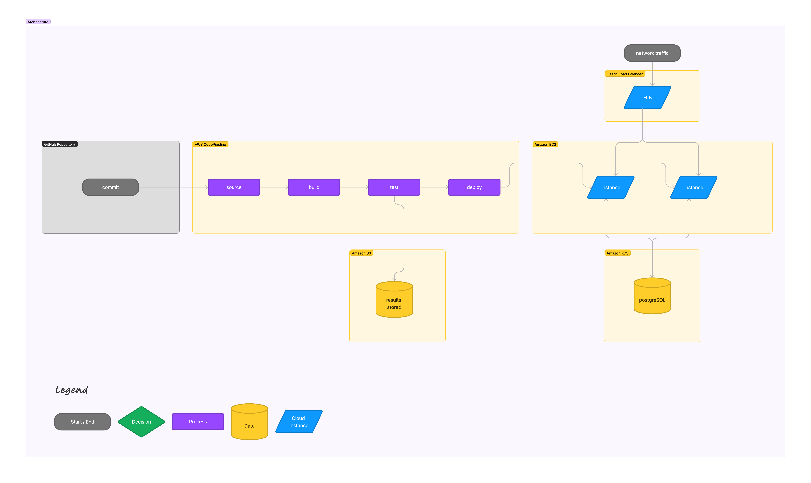

# Capstone Matching

## Developer Setup
1. install ruby version 3.2.2
2. install rails version 7.0.7.2
3. ```git clone git@github.com:Capstone-Matching/capstone-matching.git```
4. ```cd capstone-matching```
5. ```git config --global pull.rebase true```

## Developer Testcases
1. ```bundle exec cucumber```
1. ```bundle exec rspec```

## Developer Workflow
1. An issue will be assigned to you
2. Make a feature branch for an issue
3. When making a pull request back to ```main```, use the words ```Resolves <Issue #>``` in the title. For example, ```Resolves #123```
4. Wait for approval
5. Before merging the PR, ```git pull```.
6. Testcases will be run and code will be deployed onto the cloud

## Developer Run Ruby on Rails Project
1. ```cd capstone-matching```
2. ```bin/rails server -p 3000 -b 0.0.0.0```

## Deployment instructions (cloud only)
1. initialize ec2
2. walk through cloud-init.sh
3. bash start-script.sh

## Cloud Architecture



## Info
* Ruby version
3.2.2

* Rails version
7.0.7.2

* System dependencies

* Configuration

* Database creation

* Database initialization

* How to run the test suite

* Services (job queues, cache servers, search engines, etc.)

https://guides.rubyonrails.org/command_line.html

we will redeploy to heroku after completion

AWS Cloud9 is an optional IDE

## Detailed Deployment Instructions
```
# SETUP GITHUB CONNECTION
ssh-keygen -t ed25519 -C "lagunazachary@gmail.com"
eval "$(ssh-agent -s)"
ssh-add ~/.ssh/id_ed25519
cat .ssh/id_ed25519.pub 
# add to github HERE

# GIT CLONE REPO (READ-ONLY)
git clone https://github.com/Capstone-Matching/capstone-matching.git

# not sure if this is required
sudo apt-get update 
sudo apt-get install git-core zlib1g-dev build-essential libssl-dev libreadline-dev libyaml-dev libsqlite3-dev sqlite3 libxml2-dev libxslt1-dev libcurl4-openssl-dev software-properties-common libffi-dev nodejs yarn

# INSTALL RBENV
curl -fsSL https://github.com/rbenv/rbenv-installer/raw/HEAD/bin/rbenv-installer | bash
~/.rbenv/bin/rbenv init
echo 'eval "$(/home/ubuntu/.rbenv/bin/rbenv init - bash)"' >> /home/ubuntu/.bashrc
wget -q "https://github.com/rbenv/rbenv-installer/raw/HEAD/bin/rbenv-doctor" -O- | bash

# INSTALL RUBY VERSION
rbenv install 3.2.2 --verbose # may take a while; may need to change timeout
rbenv global 3.2.2
gem install bundler
# bundle config set --local without 'production'
# bundle install

# INSTALL RAILS
gem update --system
gem install rails -v 7.0.7.2
# rails new capstone-matching

# INSTALL CODEDEPLOY AGENT FOR AWS; note that this installs another version of ruby
sudo apt install ruby-full
sudo apt install wget
wget https://aws-codedeploy-us-east-2.s3.us-east-2.amazonaws.com/latest/install
chmod +x ./install
sudo ./install auto
# sudo service codedeploy-agent status
# if not running
sudo service codedeploy-agent start

# MAKE DEPLOY FOLDER FOR CODEDEPLOY TO DEPLOY TO
mkdir /home/ubuntu/capstone-matching-deploy

# MAKE SYSTEMD SERVICE
# sudo vi /etc/systemd/system/capstonematching.service
sudo cp /home/ubuntu/capstone-matching/capstonematching.service /etc/systemd/system/capstonematching.service
sudo systemctl daemon-reload

# AWS CLOUD9
sudo apt install python3-pip
sudo apt install python2
# install from the aws console
# this may be helpful: https://linux.how2shout.com/how-to-install-python-2-7-on-ubuntu-20-04-lts/

```
